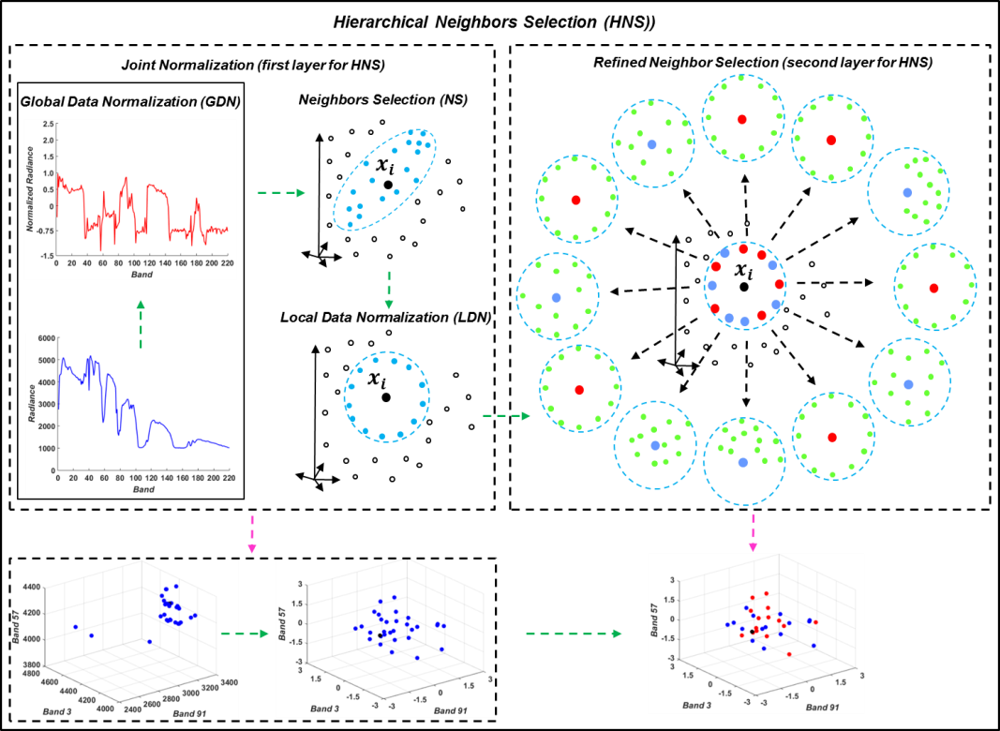

# Learning a Robust Local Manifold Representation for Hyperspectral Dimensionality Reduction

Danfeng Hong, Naoto Yokoya, Xiaoxiang Zhu
---------------------

The code in this toolbox implements the ["Learning a Robust Local Manifold Representation for Hyperspectral Dimensionality Reduction"](https://ieeexplore.ieee.org/document/7985008).
More specifically, it is detailed as follow.

Citation
---------------------

**Please kindly cite the papers if this code is useful and helpful for your research.**

Danfeng Hong, Naoto Yokoya, Xiao Xiang Zhu. Learning a Robust Local Manifold Representation for Hyperspectral Dimensionality Reduction, IEEE Journal of Selected Topics in Applied Earth Observations and Remote Sensing, 2017, 10(6): 2960-2975. 

     @article{hong2017learning,
      title     = {Learning a robust local manifold representation for hyperspectral dimensionality reduction},
      author    = {D. Hong and N. Yokoya and X. Zhu},
      journal   = {IEEE J. Sel. Top. Appl. Earth Obs. Remote Sens.},
      volume    = {10},
      number    = {6},
      pages     = {2960--2975},
      year      = {2017},
      publisher = {IEEE}
     }

System-specific notes
---------------------
The code was tested in Matlab R2016a or higher versions on Windows 10 machines.

How to use it?
---------------------

Directly run demo.m to reproduce the results on the IndinePine dataset, which exists in the aforementioned paper.

If you want to run the code in your own data, you can accordingly change the input (e.g., data, ground truth, and num_class) and tune the parameters.

If you encounter the bugs while using this code, please do not hesitate to contact us.

Licensing
---------

Copyright (C) 2019 Danfeng Hong

This program is free software: you can redistribute it and/or modify it under the terms of the GNU General Public License as published by the Free Software Foundation, version 3 of the License.

This program is distributed in the hope that it will be useful, but WITHOUT ANY WARRANTY; without even the implied warranty of MERCHANTABILITY or FITNESS FOR A PARTICULAR PURPOSE. See the GNU General Public License for more details.

You should have received a copy of the GNU General Public License along with this program.

Contact Information:
--------------------

Danfeng Hong: hongdanfeng1989@gmail.com 
Danfeng Hong is with the Remote Sensing Technology Institute (IMF), German Aerospace Center (DLR), Germany;  
&nbsp; &nbsp; &nbsp; &nbsp; &nbsp; &nbsp; &nbsp; &nbsp; &nbsp; &nbsp; &nbsp; &nbsp; &nbsp; &nbsp; with the Singnal Processing in Earth Oberservation (SiPEO), Technical University of Munich (TUM), Germany. 
